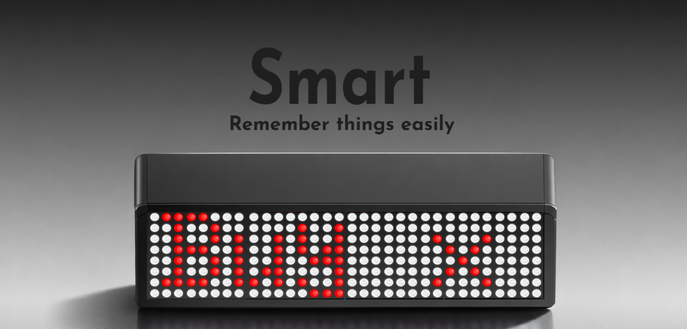
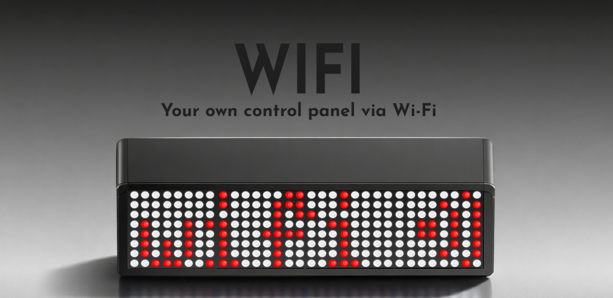
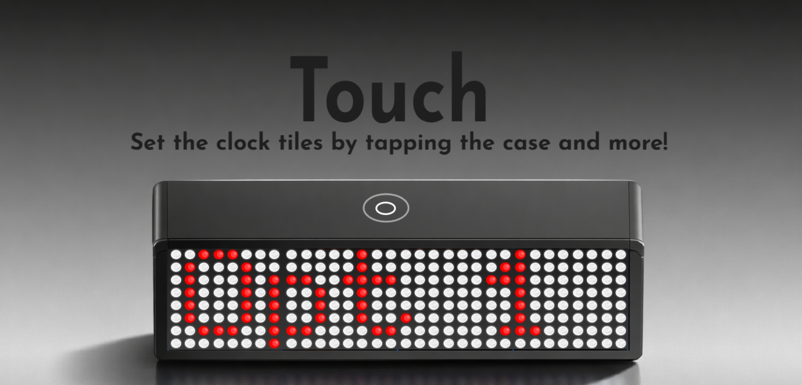
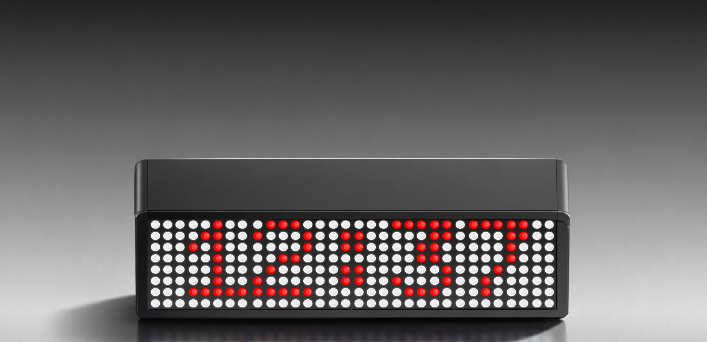
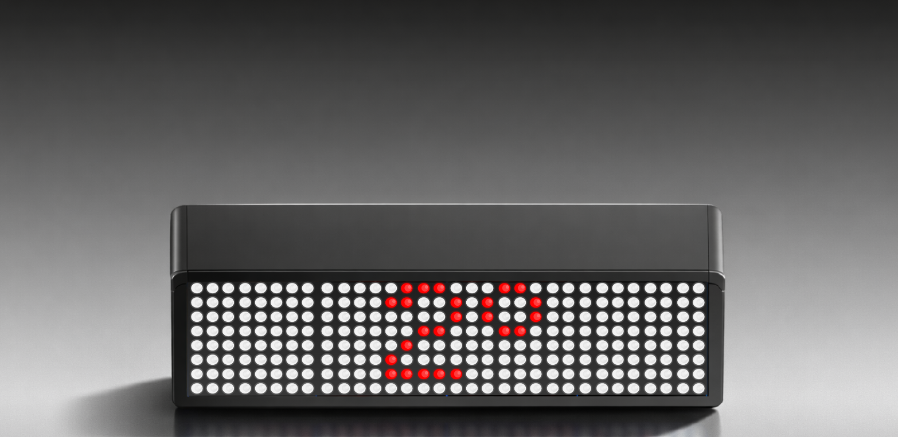
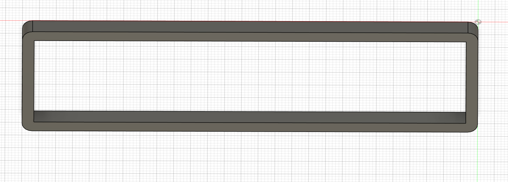

# MAX7219 Smart Desk Clock
A compact and modern smart desk clock designed for everyday use.

# Device Info
### Automatic Date & Time Sync

- The clock automatically connects to your home Wi-Fi network and synchronizes the current date and time, eliminating the need for manual setup.

### Smart Features and Touch Controls

### Display Features

- Time and date

- Reminders

- Temperature

- Atmospheric pressure

### Wireless Configuration

- Full wireless configuration using your computer

### Touch Button Functions

- Hold for 2 seconds – Enable a carousel that cycles through Time, Date, Temperature, and Reminders (if available) / Hold again to disable the carousel.

- Single tap – Turn the display off / Single tap again – Turn the display on

# Product Photos 
## See a Video (CLick the image)

## Images

### 3D Parts

### Schematics

# BOM
| Quantity | Component           |
|:--------:|:-------------------:|
| 1        | MAX7219 | 
| 1        | ESP32 C3|
| 1        | Boost Convertor | 
| 1       | Touch Sensor       |
| 1        |2000Mah Battery|
| 1        |Temperature sensor | 
| 1        |Switch | 

